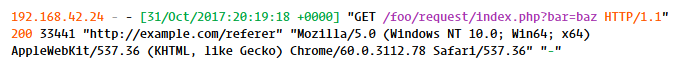
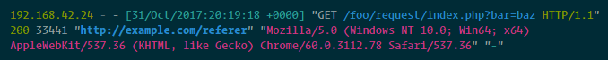

# Nginx Log Highlighting

A Sublime Text 3 package that adds support for NGINX access log syntax highlighting.

The expected format is:

`remote_addr` `-` `remote_user` `[time_local]` "`request_verb` `request_endpoint` `request_result`" `status` `body_bytes_sent` "`http_referer`" "`http_user_agent`" "`http_x_forwarded_for`"

Where the three `http*` elements after `body_bytes_sent` are optional.

### How do I use this?

1. Open an access.log file in Sublime, or paste a few log lines in an empty tab.
2. In the Command Palette, select `Set Syntax: Nginx Log`. You can also change the syntax in the lower-right menu.
3. That's it! If you want to change some colors, see below.

### Example

Here's an example NGINX log output line, which can also be used to test your color scheme:

```
192.168.42.24 - - [31/Oct/2017:20:19:18 +0000] "GET /foo/request/index.php?bar=baz HTTP/1.1" 200 33441 "http://example.com/referer" "Mozilla/5.0 (Windows NT 10.0; Win64; x64) AppleWebKit/537.36 (KHTML, like Gecko) Chrome/60.0.3112.78 Safari/537.36" "-"
```

#### Default colors

Using a default scheme, you'll see some color variation, e.g.: 

**IDLE**




**Solarized-dark**




#### Custom colors

The syntax of a log line is parsed into multiple scopes. Using the example line above, here are the assigned scopes (all prefixed with `text.nginx meta.nginx.log`):

| Built-In Scope | Custom Scope | Log piece |
| ----- | ----- | ----- |
| keyword | remote_addr | 192.168.42.24 |
| comment | spacer | -  |
| text | remote_user | -  |
| string | time_local | [31/Oct/2017:20:19:18 +0000]  |
| constant | request_type | GET  |
| support.function | request | /foo/request/index.php?bar=baz  |
| keyword.operator | request_result | HTTP/1.1 |
| keyword.other | status | 200  |
| entity.other.attribute-name | body_bytes_sent | 33441  |
| entity.name.tag | http_referer | http://example.com/referer |
| constant.numeric | http_user_agent | Mozilla/5.0 (Windows NT 10.0; Win64; x64) AppleWebKit/537.36 (KHTML, like Gecko) Chrome/60.0.3112.78 Safari/537.36 |
| string | http_x_forwarded_for | - |

The built-in scopes don't necessarily correspond to the log piece type; they're simply different scopes that most robust themes include a different color for, and will help make your log statements stand out without adding custom theme definitions.

If you do want to style each piece yourself, add a style definition for each scope to your `.tmTheme` file, like this:

```xml
    <dict>
        <key>name</key>
        <string>remote_addr</string>
        <key>scope</key>
        <string>text.nginx meta.nginx.log remote_addr</string>
        <key>settings</key>
        <dict>
            <key>foreground</key>
            <string>#FF4D4D</string>
        </dict>
    </dict>
```

### TO-DO

  - [ ] Add support for other log formats (or a custom format)
  - [x] Add theme file and/or example color scheme definitions
